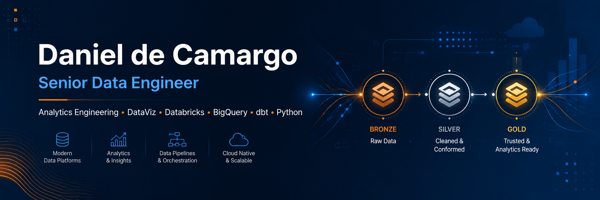
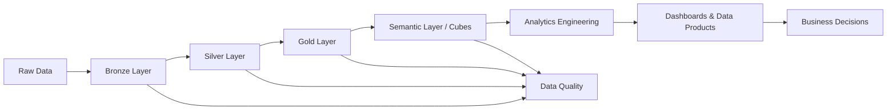

<p align="center">
  
</p>

# Daniel de Camargo

## Senior Data Engineer | Analytics Engineer | Data Visualization Specialist

Transformo dados em soluções escaláveis, confiáveis e orientadas ao negócio.

Atuo com Engenharia de Dados, Analytics Engineering, Business Intelligence, Data Visualization e Business Analytics, desenvolvendo pipelines modernos, arquiteturas em nuvem, modelos analíticos, cubos, camadas semânticas e dashboards executivos.

Tenho experiência com Databricks, BigQuery, dbt, Python, SQL, Power BI, Tableau, Looker, QlikView, Qlik Sense, Google Cloud Platform, Microsoft Azure e MGC, sempre buscando unir qualidade técnica, performance, governança e clareza na entrega de dados.

---

## Sobre mim

Sou profissional de Dados com experiência em Engenharia de Dados, Business Intelligence, Analytics Engineering, Data Visualization e Business Analytics.

Ao longo da minha carreira, participei de projetos envolvendo construção de pipelines, modelagem dimensional, arquitetura Medallion, qualidade de dados, migração de ambientes analíticos, cubos analíticos, camadas semânticas, integração entre fontes de dados e desenvolvimento de dashboards para apoio à decisão.

Também atuo na ponte entre tecnologia e negócio, apoiando levantamento de requisitos, criação de mockups, definição de KPIs, estruturação de projetos analíticos e entrega de soluções orientadas à tomada de decisão.

Meu foco é construir soluções de dados bem documentadas, escaláveis e fáceis de manter, conectando engenharia, analytics, visualização e negócio para gerar valor real.

---

## Principais especialidades

* Engenharia de Dados
* Analytics Engineering
* Business Intelligence
* Business Analytics
* Data Visualization
* Arquitetura Medallion
* Pipelines de dados
* Modelagem dimensional
* Camadas semânticas
* Cubos analíticos
* Data Quality
* Observabilidade de dados
* Governança de dados
* Definição de KPIs
* Criação de mockups
* Storytelling com dados
* Estruturação de projetos analíticos
* Metodologias ágeis

---

## Stack técnica

### Data Engineering & Analytics


* Pipelines de dados
* Arquitetura Medallion
* Modelagem dimensional
* Camadas Bronze, Silver e Gold
* Data Quality
* Data Observability
* Cubos analíticos
* Camadas semânticas
* Analytics Engineering

### Cloud & Data Platforms


* Google Cloud Platform
* Microsoft Azure
* MGC / Cloud corporativa
* BigQuery
* Databricks
* Cubos analíticos em ambientes Azure e cloud
* Plataformas corporativas de dados

### Programming, Versioning & Automation


* Python para automação, processamento e análise
* SQL para transformação, investigação e modelagem
* Git para versionamento de projetos
* Estruturação de repositórios técnicos
* Documentação de soluções de dados

### Data Visualization & BI


* Power BI
* Tableau
* Looker
* QlikView
* Qlik Sense
* Dashboards executivos
* Dashboards operacionais
* DataViz
* Storytelling com dados
* Definição de KPIs e indicadores
* Criação de mockups analíticos

### Business Analytics & Delivery


* Levantamento de requisitos
* Estruturação de projetos analíticos
* Criação de mockups
* Atuação com áreas de negócio
* Priorização de demandas
* Scrum
* Kanban
* Jira
* ClickUp
* Microsoft Azure DevOps

---

## Arquitetura de dados



---

## Como penso soluções de dados

Minha abordagem combina engenharia, qualidade, analytics e visão de negócio:

```text
Entendimento do problema
        ↓
Levantamento de requisitos
        ↓
Definição de KPIs e regras de negócio
        ↓
Mapeamento das fontes
        ↓
Ingestão e organização dos dados
        ↓
Tratamento, padronização e validação
        ↓
Modelagem dimensional e camada semântica
        ↓
Cubos, marts ou produtos de dados
        ↓
Dashboards, APIs ou análises
        ↓
Monitoramento e melhoria contínua
```

---

## Projetos em destaque

<table>
  <tr>
    <td width="50%">
      <h3>Medallion Architecture</h3>
      <p>Pipeline de dados estruturado em camadas Bronze, Silver e Gold, com foco em ingestão, tratamento, qualidade e modelo analítico.</p>
      <strong>Tecnologias:</strong> Databricks, PySpark, Delta, SQL
    </td>
    <td width="50%">
      <h3>dbt Analytics Project</h3>
      <p>Projeto analítico com organização em staging, intermediate e marts, aplicando testes, documentação e boas práticas de Analytics Engineering.</p>
      <strong>Tecnologias:</strong> dbt, SQL, BigQuery
    </td>
  </tr>
  <tr>
    <td width="50%">
      <h3>Data Quality Framework</h3>
      <p>Framework para validações de qualidade, integridade, duplicidade, nulos, relacionamentos entre dimensões e consistência de dados.</p>
      <strong>Tecnologias:</strong> Python, SQL, BigQuery
    </td>
    <td width="50%">
      <h3>GA4 BigQuery dbt</h3>
      <p>Pipeline para tratamento de eventos do Google Analytics 4, com flatten de dados, modelagem analítica e preparação para consumo em BI.</p>
      <strong>Tecnologias:</strong> GA4, BigQuery, dbt, SQL
    </td>
  </tr>
  <tr>
    <td width="50%">
      <h3>DataViz Portfolio</h3>
      <p>Portfólio com dashboards executivos e analíticos, demonstrando KPIs, storytelling, mockups, modelagem e boas práticas de visualização.</p>
      <strong>Tecnologias:</strong> Power BI, Tableau, Looker, Qlik
    </td>
    <td width="50%">
      <h3>Data Observability</h3>
      <p>Projeto para monitoramento de pipelines, volumetria, freshness, falhas, tempo de execução e indicadores de confiabilidade dos dados.</p>
      <strong>Tecnologias:</strong> Python, SQL, Streamlit
    </td>
  </tr>
  <tr>
    <td width="50%">
      <h3>Semantic Layer & Cubes</h3>
      <p>Projeto voltado à construção de camadas semânticas e cubos analíticos para consumo em ferramentas de BI e áreas de negócio.</p>
      <strong>Tecnologias:</strong> Azure, MGC, SQL, BI
    </td>
    <td width="50%">
      <h3>Business Analytics Case</h3>
      <p>Projeto simulando a jornada desde o levantamento de requisitos, criação de mockups, definição de indicadores e entrega de dashboard.</p>
      <strong>Tecnologias:</strong> BA, DataViz, Jira, Scrum, Kanban
    </td>
  </tr>
</table>

---

## Atualmente estudando e evoluindo em

* Databricks em ambientes produtivos
* dbt avançado
* Data Quality e Data Observability
* CI/CD para pipelines de dados
* Governança de dados
* Arquiteturas modernas em cloud
* Camadas semânticas e produtos de dados
* Aplicações de IA em Engenharia de Dados

---

## Experiência resumida

* Engenharia de Dados
* Analytics Engineering
* Business Intelligence
* Business Analytics
* Data Visualization
* Cloud Data Platforms
* Modelagem dimensional
* Cubos analíticos
* Camadas semânticas
* Qualidade e observabilidade de dados
* Dashboards executivos e analíticos
* Estruturação de projetos orientados a dados

---

## Contato

* LinkedIn: [danieldecamargo79](https://www.linkedin.com/in/danieldecamargo79/)
* E-mail: [daniel.de.camargo79@gmail.com](mailto:daniel.de.camargo79@gmail.com)
